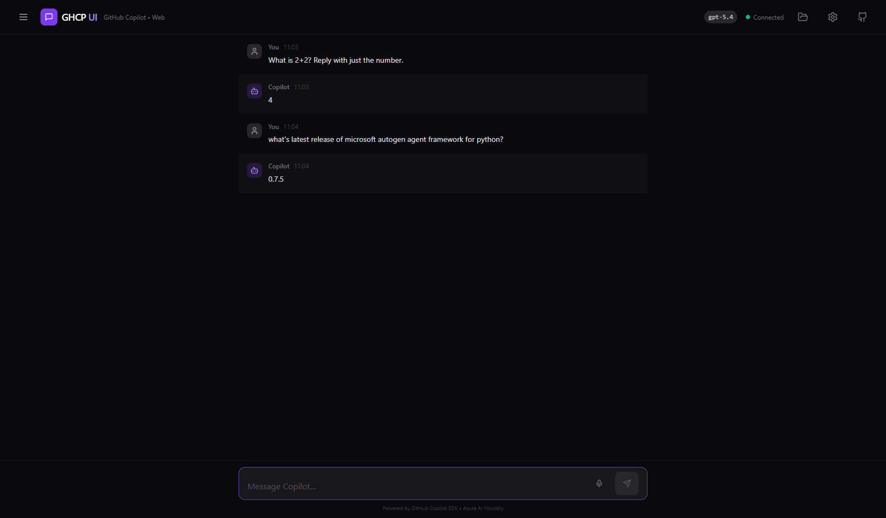
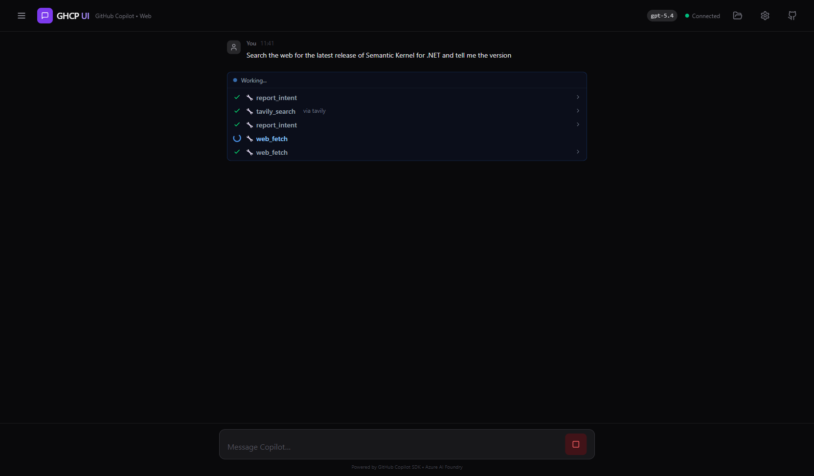
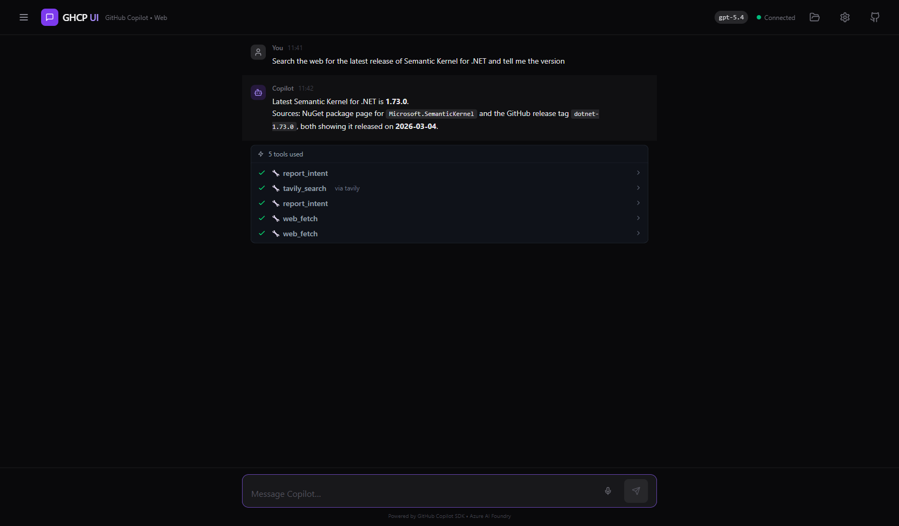

# GHCP UI — GitHub Copilot Web Interface

A modern web UI for [GitHub Copilot SDK](https://github.com/github/copilot-sdk), hosted on Azure Container Apps and powered by Azure AI Foundry (BYOK).

> **Why?** Copilot CLI is incredible, but it's terminal-only. This project brings the same agentic power to any device with a browser — desktop, tablet, or phone.

   

## Screenshots

| Live Chat | Tool Progress |
|-----------|---------------|
|  |  |



## Features

- 🤖 **Full Copilot SDK** — agentic chat sessions via `@github/copilot-sdk` with SSE streaming
- 💬 **Session management** — create, resume, rename, and delete sessions; SDK-native persistence
- 📱 **Mobile-first** — responsive drawer sidebar, safe-area-inset, 44px touch targets, `dvh` viewport
- 🔑 **Per-user identity** — Azure EasyAuth (Entra ID); each user gets isolated sessions & config
- 🔌 **MCP servers** — per-user persistent MCP config (mslearn, context7, tavily, mem0, custom); admin global servers
- 🧩 **Model selector** — pick from deployed models in your Azure AI Foundry instance
- 📂 **Workspace files** — per-user file storage (Azure Files), drag-drop upload, AI can read/write
- 🛠️ **Tool progress** — live tool-usage indicators during streaming; auto-collapse on completion
- 📋 **Code copy** — per-code-block copy buttons with language labels in markdown output
- ⚙️ **Settings drawer** — admin servers (read-only), your servers (CRUD), model info
- 🏗️ **Azure-ready** — full Bicep infrastructure, azd deployment, CI/CD pipeline

## Architecture

```
┌─────────────────┐    SSE/REST     ┌──────────────────┐    JSON-RPC    ┌─────────────┐
│  React Frontend │ ◄────────────► │  Express Backend  │ ◄──────────► │ Copilot CLI  │
│  (Vite+Tailwind)│                 │  (@github/sdk)    │               │ (server mode)│
└─────────────────┘                 └──────────────────┘               └──────────────┘
                                            │                                  │
                                            │ BYOK (API Key)                   │ MCP Servers
                                            ▼                                  ▼
                                   ┌──────────────────┐          ┌──────────────────┐
                                   │ Azure AI Foundry  │          │ Remote MCP (HTTP) │
                                   │ (GPT-4.1 / etc.) │          │ mslearn, context7 │
                                   └──────────────────┘          │ tavily, mem0, ... │
                                            │                    └──────────────────┘
                                            ▼
                                   ┌──────────────────┐
                                   │  Azure Files      │
                                   │  (per-user state) │
                                   └──────────────────┘
```

## Tech Stack

| Layer          | Technology                                                    |
| -------------- | ------------------------------------------------------------- |
| **Frontend**   | React 19, Vite 6, TypeScript 5.7, Tailwind CSS 4              |
| **Backend**    | Express.js 5, TypeScript, `@github/copilot-sdk`               |
| **Streaming**  | Server-Sent Events (SSE)                                      |
| **Auth**       | Azure Container Apps EasyAuth (Microsoft Entra ID)             |
| **Storage**    | Azure Files (per-user sessions, MCP config, workspace)         |
| **Infra**      | Azure Container Apps, AI Foundry, ACR, Key Vault, Storage      |
| **IaC**        | Bicep (azd-compatible)                                         |
| **CI/CD**      | GitHub Actions with federated OIDC auth                        |
| **Testing**    | Playwright (32 e2e tests)                                      |

## Prerequisites

- [Node.js 22+](https://nodejs.org/)
- [GitHub Copilot CLI](https://docs.github.com/en/copilot/how-tos/set-up/install-copilot-cli) — `copilot` must be in PATH
- [Azure Developer CLI (azd)](https://learn.microsoft.com/en-us/azure/developer/azure-developer-cli/install-azd) — for deployment
- A [GitHub Copilot subscription](https://github.com/features/copilot) (or use BYOK with Azure AI Foundry)

## Quick Start — Local Development

```bash
# Clone and install
git clone https://github.com/aiappsgbb/ghcp-ui.git && cd ghcp-ui
npm install

# Configure environment
cp .env.example .env
# Edit .env with your Azure AI Foundry endpoint + key (or use GitHub auth)

# Run both frontend + backend in dev mode
npm run dev
```

- **Frontend**: http://localhost:5173
- **Backend API**: http://localhost:3001
- Vite proxies `/api/*` calls to the backend automatically.

## Deploy to Azure

### One-command deployment

```bash
azd auth login
azd up
```

This provisions:
- **Resource Group** with all resources
- **Azure Container Registry** for Docker images
- **Azure OpenAI** (AI Foundry) with model deployments
- **Key Vault** for secrets management
- **Azure Storage Account** with Files share for per-user state
- **Log Analytics** for monitoring
- **Container Apps Environment** with the app + CORS policy
- **User-Assigned Managed Identity** with RBAC on all resources

### Post-deployment

1. **Configure EasyAuth** (optional) — enable Microsoft Entra ID authentication via Azure Portal or CLI
2. **Seed MCP config** — use the `PUT /api/mcp-servers/user` API to configure per-user MCP servers
3. **Cleanup** — run `azd down` to tear down all resources

### Environment Variables

Set these in `.env` for local dev or as azd environment variables:

| Variable                          | Description                          | Required |
| --------------------------------- | ------------------------------------ | -------- |
| `AZURE_FOUNDRY_ENDPOINT`          | Azure OpenAI endpoint URL            | For BYOK |
| `AZURE_FOUNDRY_API_KEY`           | Azure OpenAI API key                 | For BYOK |
| `AZURE_FOUNDRY_MODEL`             | Model name (default: `gpt-5.4`)     | No       |
| `PORT`                            | Server port (default: `3001`)        | No       |
| `COPILOT_GITHUB_TOKEN`            | GitHub token (alternative to BYOK)   | No       |
| `WORKSPACE_MOUNT_PATH`            | Azure Files mount path               | No       |

## Workspace & Per-User MCP

Each authenticated user gets:
- **Isolated sessions** — stored under `{mount}/{userId}/.copilot/`
- **Personal MCP servers** — persisted in `{mount}/{userId}/mcp-config.json`
- **Workspace files** — available to the AI via a filesystem MCP server

MCP servers are merged in layers: **Admin (global)** → **User (persistent)** → **Per-session (ephemeral)**

## Project Structure

```
ghcp-ui/
├── src/
│   ├── client/              # React frontend
│   │   ├── src/
│   │   │   ├── components/  # UI (Chat, Sidebar, Header, Settings, etc.)
│   │   │   ├── hooks/       # React hooks (useChat, useSessions)
│   │   │   └── types/       # TypeScript types
│   │   └── vite.config.ts
│   └── server/              # Express backend
│       └── src/
│           ├── services/    # CopilotService, WorkspaceService, UserMcpService
│           ├── routes/      # API routes (chat, sessions, workspace, health)
│           └── middleware/  # EasyAuth identity extraction
├── tests/                   # Playwright e2e tests (32 tests)
├── infra/                   # Bicep infrastructure
│   ├── main.bicep           # Entry point
│   └── modules/             # ACR, ACA, AI, KV, Storage, RBAC, etc.
├── Dockerfile               # Multi-stage production build
├── docker-compose.yml       # Local container testing
├── azure.yaml               # azd configuration
└── .github/workflows/ci.yml # CI/CD pipeline
```

## API Endpoints

| Method   | Path                              | Description                |
| -------- | --------------------------------- | -------------------------- |
| `GET`    | `/api/healthz`                    | Health check               |
| `GET`    | `/api/readyz`                     | Readiness check            |
| `GET`    | `/api/me`                         | Current user identity      |
| `GET`    | `/api/sessions`                   | List all sessions          |
| `POST`   | `/api/sessions`                   | Create a new session       |
| `POST`   | `/api/sessions/:id/resume`        | Resume paused session      |
| `PATCH`  | `/api/sessions/:id`               | Rename session             |
| `DELETE` | `/api/sessions/:id`               | Delete a session           |
| `GET`    | `/api/sessions/:id/messages`      | Get session messages       |
| `POST`   | `/api/chat/:sessionId`            | Send message (SSE stream)  |
| `GET`    | `/api/models`                     | List available models      |
| `GET`    | `/api/mcp-servers`                | List admin MCP servers     |
| `GET`    | `/api/mcp-servers/user`           | List user MCP servers      |
| `PUT`    | `/api/mcp-servers/user`           | Update user MCP servers    |
| `DELETE` | `/api/mcp-servers/user/:name`     | Remove a user MCP server   |
| `GET`    | `/api/workspace/:userId/files`    | List workspace files       |
| `POST`   | `/api/workspace/:userId/files`    | Upload file                |

## ⚠️ Disclaimer

- This project is a **community/demo effort**, not an official GitHub or Microsoft product.
- **Do not use in production** without proper security hardening, authentication, and secret management review.
- Azure resources provisioned by `azd up` **will incur costs** — remember to `azd down` when done.
- API keys and tokens are managed via Key Vault; never commit secrets to source code.

## Contributing

1. Fork the repo
2. Create a feature branch (`git checkout -b feature/amazing`)
3. Run tests: `npx playwright test`
4. Commit your changes and open a PR

## License

[MIT](LICENSE)
